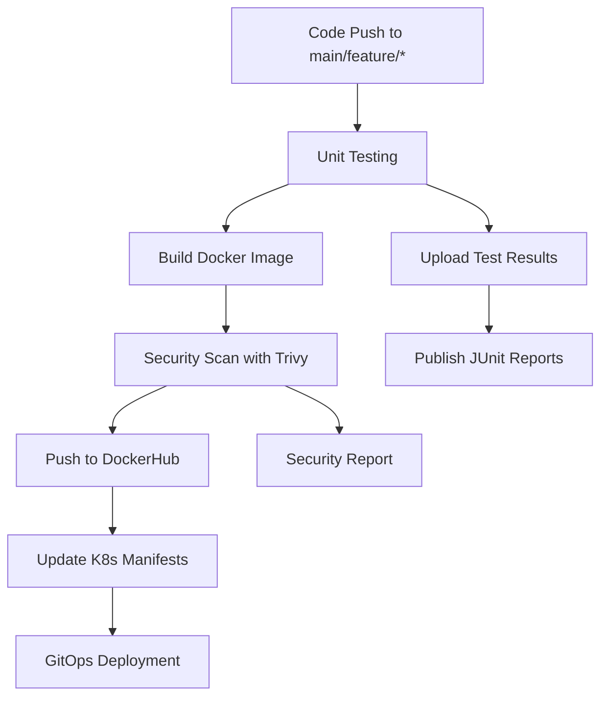

# Petclinic CI (Continuous Integration)


A fully automated CI pipeline for the Spring Boot Pet Clinic application using GitHub Actions, Docker, and Kubernetes with GitOps deployment.

## 🚀 Pipeline Overview

This pipeline demonstrates modern DevOps practices with automated testing, security scanning, containerization, and GitOps deployment. The entire process is triggered automatically on code changes and provides complete traceability from code to production.

## 📋 Pipeline Flow



## 🔧 Pipeline Stages

### 1. **Unit Testing** 📊
- **Trigger**: Push to `main` or `feature/*` branches, or manual dispatch
- **Environment**: Ubuntu Latest with Java 21 (Temurin distribution)
- **Actions**:
  - Checkout source code
  - Setup Java environment with Maven caching
  - Run unit tests (excluding PostgresIntegrationTests)
  - Upload test artifacts (Surefire & Failsafe reports)
  - Publish JUnit test results with detailed reporting

**Key Features:**
- Maven cache optimization for faster builds
- Comprehensive test reporting
- Artifact preservation for debugging

### 2. **Build, Scan & Push** 🔨🛡️
- **Dependencies**: Requires successful unit testing
- **Security First Approach**: Image scanning before deployment
- **Actions**:
  - Docker Hub authentication
  - Build Docker image with unique SHA tag
  - **Security Scanning** with Trivy for vulnerabilities
    - Scans for CRITICAL and HIGH severity issues
    - Covers OS and library vulnerabilities
    - Continues pipeline even with findings (configurable)
  - Push verified image to Docker Hub

**Security Highlights:**
- Trivy scanner integration for container security
- Non-blocking security checks with detailed reporting
- Unique image tagging with Git SHA for traceability

### 3. **GitOps Deployment** 🚀
- **Dependencies**: Requires successful build and scan
- **Automated Manifest Updates**: 
  - Dynamic image tag replacement in Kubernetes manifests
  - Automatic commit and push to trigger GitOps workflow
- **Actions**:
  - Token-based replacement of `{IMAGE}` placeholder
  - Automated commit with descriptive message
  - Git push using Personal Access Token

## 🐳 Docker Configuration

### Multi-stage Dockerfile
Located in `/pet-clinic/Dockerfile`:

```dockerfile
# Build Stage
FROM maven:3.9.6-eclipse-temurin-17-alpine AS builder
WORKDIR /app
COPY . .
RUN ./mvnw package

# Runtime Stage  
FROM eclipse-temurin:17-jdk-alpine-3.22
WORKDIR /app
COPY --from=builder /app/target/*.jar app.jar
ENTRYPOINT ["java", "-jar", "app.jar"]
```

**Benefits:**
- **Multi-stage build** reduces final image size
- **Alpine Linux** base for minimal attack surface
- **Maven wrapper** for consistent builds
- **Optimized layering** for better caching

## ☸️ Kubernetes Architecture

### Application Architecture
The application follows a **3-tier architecture** deployed on Kubernetes:

1. **Frontend/API Tier**: Spring Boot application
2. **Database Tier**: MySQL with persistent storage
3. **Ingress Layer**: External access management

### Resource Organization

```yaml
# kustomization.yaml - GitOps Configuration
resources:
  - config-maps/app-cm.yml      # Application configuration
  - secrets/sealed-secret.yaml   # 🔐 Encrypted secrets
  - pvc/pvc.yml                 # Persistent storage
  - Deployments/db-deployment.yml    # Database deployment
  - Deployments/app-deployment.yml   # Application deployment  
  - services/app-svc.yml        # Application service
  - services/db-svc.yml         # Database service
  - ingress/ingress.yml         # External access
```

### 🔐 Enhanced Security with Sealed Secrets

**Why Sealed Secrets?**
- **NOT** base64 encoded secrets (easily decodable)
- **Encrypted** at rest using asymmetric cryptography  
- **Safe** to store in Git repositories
- **Automatic decryption** by Sealed Secrets controller in cluster

```yaml
# Example: Database credentials encrypted with Bitnami Sealed Secrets
apiVersion: bitnami.com/v1alpha1
kind: SealedSecret
metadata:
  name: db-cred
  namespace: petclinic
spec:
  encryptedData:
    MYSQL_DATABASE: AgCLrr2mlZrGM8QFz5nt8kBp... # Encrypted!
    MYSQL_PASSWORD: AgASI66RzCzF8FNHy5ZM0MGL... # Encrypted!
    MYSQL_ROOT_PASSWORD: AgB0MuBozuk8g8AswGOUP... # Encrypted!
    MYSQL_USER: AgAEwAwiVVGrjC4NRGhLZF+sB... # Encrypted!
```

### Service Architecture

#### Application Service (`app-svc`)
```yaml
type: NodePort          # External access
port: 5000             # Spring Boot default
selector:
  tier: app            # Targets app pods
```

#### Database Service (`db-svc`)  
```yaml
type: ClusterIP        # Internal only
port: 3306            # MySQL default  
selector:
  tier: db            # Targets database pods
```

#### Persistent Storage
```yaml
# 200Mi storage for MySQL data persistence
accessModes:
  - ReadWriteOnce      # Single node access
```

### Configuration Management

#### Application ConfigMap
- **Environment-specific** settings
- **Database connection** strings  
- **Spring profiles** activation
- **Port configuration**

```yaml
data:
  SERVER_PORT: "5000"
  SPRING_PROFILES_ACTIVE: "mysql"  
  SPRING_DATASOURCE_URL: "jdbc:mysql://db-svc:3306/petclinic"
```

#### Dynamic Image Updates
The deployment manifest uses **token replacement** for GitOps:

```yaml
# Before pipeline run
image: {IMAGE}

# After pipeline run  
image: username/petclinic:abc123def
```

### External Access

#### Ingress Configuration
```yaml
host: shebl.com        # Custom domain
path: /               # Root path mapping
backend:
  service: app-svc    # Routes to application
  port: 5000
```

## 🔄 GitOps Workflow

1. **Code Change** → Triggers pipeline
2. **Tests Pass** → Build and scan image  
3. **Security Verified** → Push to registry
4. **Manifest Update** → Replace image tag automatically
5. **Git Commit** → Triggers deployment
6. **Kubernetes Sync** → Pulls new image and deploys

## 🛡️ Security Features

- ✅ **Trivy Security Scanning** - Container vulnerability assessment
- ✅ **Sealed Secrets** - Encrypted secrets management  
- ✅ **Multi-stage Builds** - Reduced attack surface
- ✅ **Alpine Base Images** - Minimal OS footprint
- ✅ **GitOps Pattern** - Audit trail and rollback capability
- ✅ **Unique Image Tags** - SHA-based versioning

## 🚀 Getting Started

### Prerequisites Installation

#### 1. **Docker Installation**
Install Docker on your system:
- **Linux**: [Docker Engine Installation](https://docs.docker.com/engine/install/)
- **Windows/Mac**: [Docker Desktop](https://docs.docker.com/desktop/)
- **Ubuntu Quick Install**:
  ```bash
  curl -fsSL https://get.docker.com -o get-docker.sh
  sudo sh get-docker.sh
  sudo usermod -aG docker $USER
  ```

#### 2. **Kubernetes Setup**

📖 **Full Guide**: [Minikube Installation](https://minikube.sigs.k8s.io/docs/start/)

📖 **Full Guide**: [kubectl Installation](https://kubernetes.io/docs/tasks/tools/)

#### 3. **Sealed Secrets Controller**


📖 **Complete Documentation**: [Sealed Secrets Installation & Usage](https://sealed-secrets.netlify.app/)

### Repository Setup

#### 1. **Fork and Clone the Repository**
```bash
# Clone the repository
# Fork the repository first on GitHub: 
 https://github.com/abdelrahman-shebl/PetClinic-app

# Clone your forked repository
git clone https://github.com/YOUR_USERNAME/PetClinic-app.git
cd PetClinic-app/CI
```


**Note**: Make sure to fork the repository first on GitHub, then clone your fork so you can push changes and trigger the CI/CD pipeline.

#### 2. **GitHub Configuration**
Configure the following in your GitHub repository:

**Secrets** (Settings → Secrets and variables → Actions → Secrets):
- `DOCKERHUB_TOKEN` - Your Docker Hub access token
- `GH_PAT` - GitHub Personal Access Token with repo permissions

**Variables** (Settings → Secrets and variables → Actions → Variables):
- `DOCKERHUB_USERNAME` - Your Docker Hub username

#### 3. **Create Docker Hub Access Token**
1. Go to [Docker Hub Account Settings](https://hub.docker.com/settings/security)
2. Click "New Access Token"
3. Copy the token and add it as `DOCKERHUB_TOKEN` secret

#### 4. **Create GitHub Personal Access Token**
1. Go to [GitHub Settings → Developer settings → Personal access tokens](https://github.com/settings/tokens)
2. Generate new token (classic) with `repo` scope
3. Copy the token and add it as `GH_PAT` secret

### Deployment

#### 1. **Deploy to Kubernetes**
```bash
# Apply all manifests using Kustomize
kubectl apply -k K8s/

# Check deployment status
kubectl get pods -n petclinic
kubectl get services -n petclinic
```

#### 2. **Access the Application**

##### For Minikube:
```bash
# Get Minikube IP and NodePort
minikube ip
kubectl get svc app-svc -n petclinic

# Access via: http://<MINIKUBE_IP>:<NODEPORT>
```

##### For Production with Ingress:
- Configure DNS: `shebl.com` → Your cluster's ingress IP
- Access via: `http://shebl.com`

### Triggering Deployments
- **Automatic**: Push to `main` or `feature/*` branches
- **Manual**: Use GitHub Actions "workflow_dispatch"

## 📈 Monitoring & Observability

- **Test Reports**: JUnit integration with GitHub Actions
- **Security Reports**: Trivy vulnerability assessments  
- **Build Artifacts**: Preserved for debugging
- **Git History**: Full deployment audit trail
- **Container Logs**: Kubernetes native logging

---

**This pipeline demonstrates enterprise-grade DevOps practices with security, automation, and observability built-in from day one.** 🏆