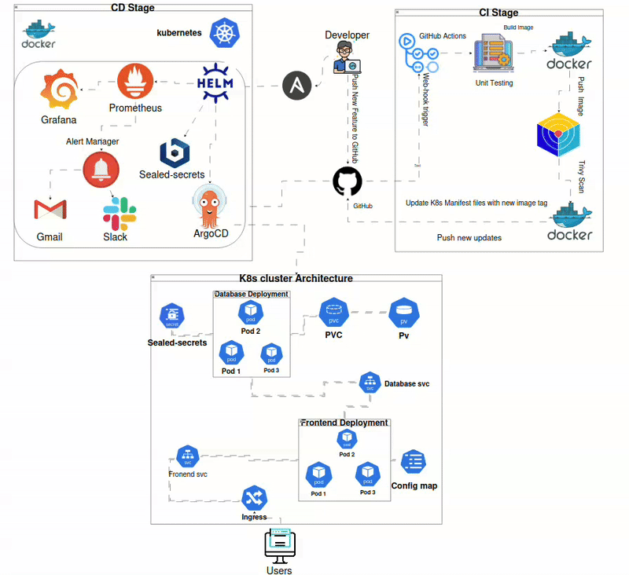
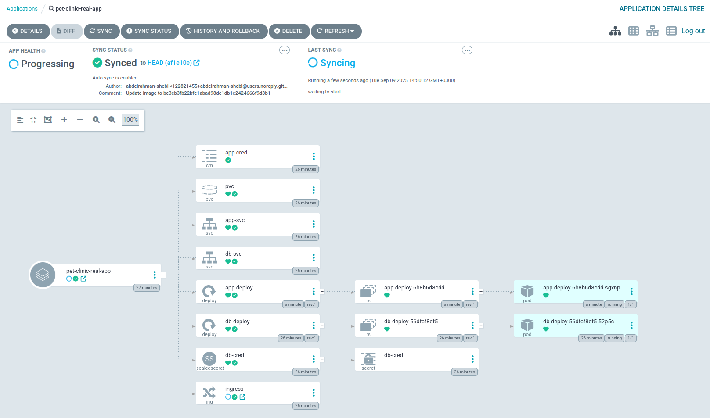
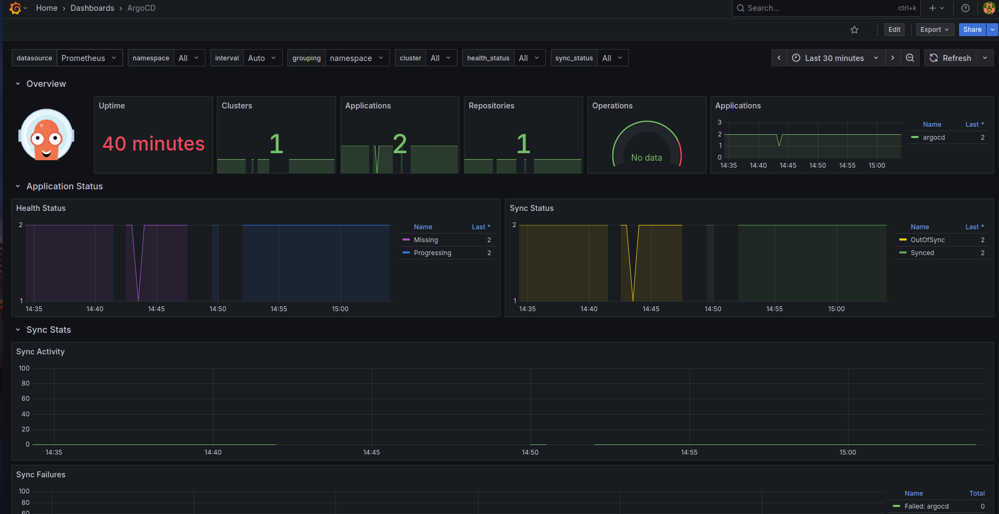
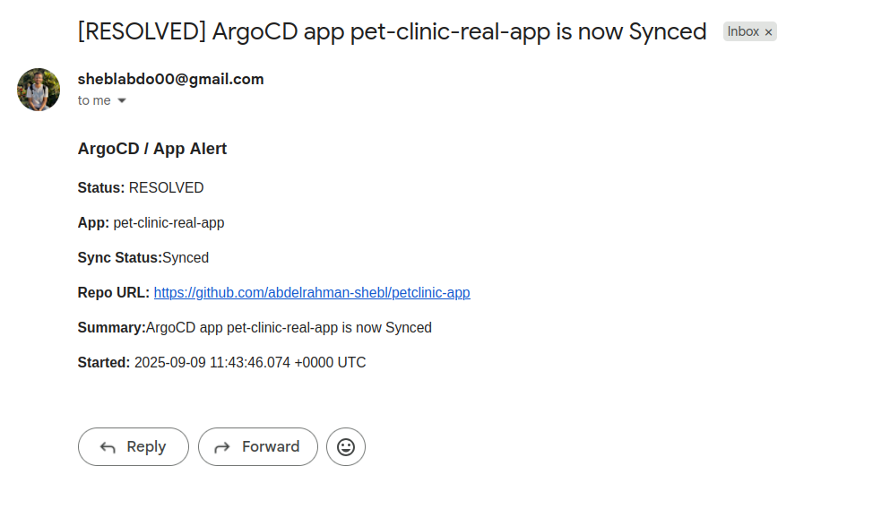
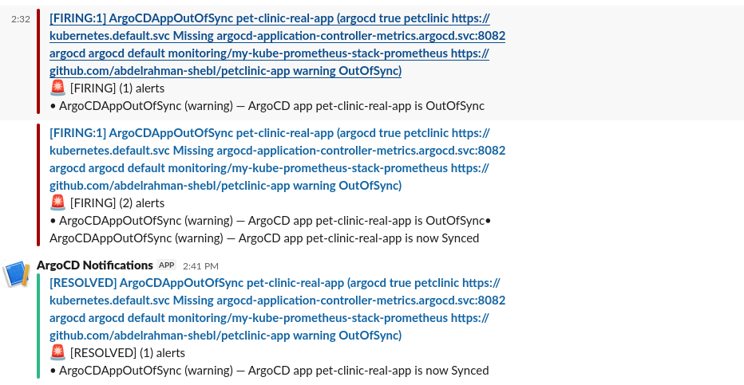
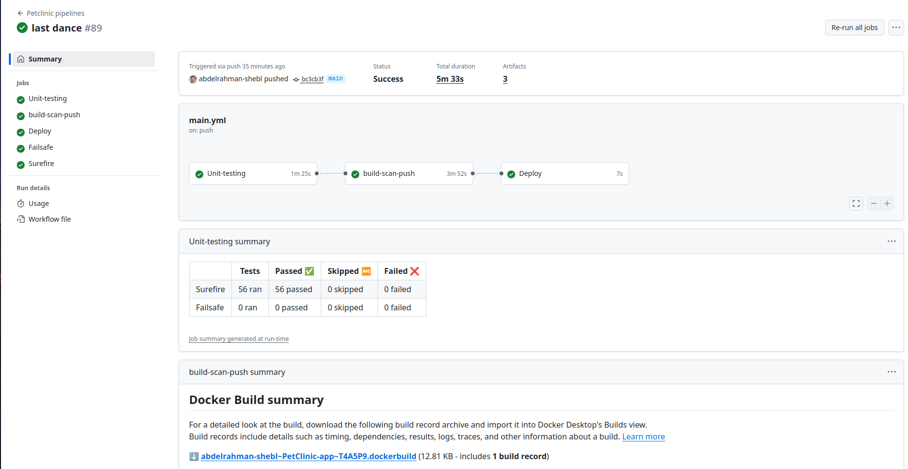

# PetClinic DevOps Pipeline - Complete CI/CD Solution

A fully automated DevOps pipeline for the Spring Boot Pet Clinic application featuring modern CI/CD practices with GitHub Actions, Docker, Kubernetes, ArgoCD, and comprehensive monitoring.

## 🎯 Project Overview

This project demonstrates enterprise-grade DevOps automation with:
- **Continuous Integration**: Automated testing, security scanning, and containerization
- **Continuous Deployment**: Infrastructure as Code with Ansible automation
- **GitOps**: Declarative deployments with ArgoCD
- **Security**: Sealed Secrets encryption and vulnerability scanning
- **Monitoring**: Prometheus, Grafana, and AlertManager stack
- **Observability**: Multi-channel alerting (Email, Slack)

## 🏗️ Overall Architecture




## 🚀 CI/CD Pipeline Flow

### **Continuous Integration (CI)**
1. **Code Push** → Triggers GitHub Actions pipeline
2. **Unit Testing** → Java 21 with Maven, JUnit reporting
3. **Docker Build** → Multi-stage optimized container images
4. **Security Scan** → Trivy vulnerability assessment
5. **Registry Push** → Tagged images to Docker Hub
6. **Manifest Update** → Automatic Kubernetes YAML updates

### **Continuous Deployment (CD)**
1. **Infrastructure Setup** → Ansible deploys complete K8s stack
2. **ArgoCD Sync** → Detects Git changes and syncs automatically
3. **Application Deploy** → Rolling deployment to Kubernetes
4. **Health Monitoring** → Prometheus metrics collection
5. **Alert Generation** → Email/Slack notifications for status changes

## 🛡️ Security & Monitoring

- **🔒 Sealed Secrets**: Real encryption (not base64) for sensitive data
- **🛡️ Trivy Scanning**: Container vulnerability assessment
- **📊 Prometheus Stack**: Metrics, alerting, and visualization
- **🎯 GitOps**: Git as single source of truth with audit trails
- **📱 Multi-Channel Alerts**: Email and Slack notifications

## 🚀 Quick Start

### **CI Setup**
1. Fork the repository and configure GitHub secrets:
   - `DOCKERHUB_TOKEN` & `DOCKERHUB_USERNAME`
   - `GH_PAT` (GitHub Personal Access Token)
2. Push code to trigger the pipeline

### **CD Setup**  
1. Prepare server inventory and run Ansible:
   ```bash
   ansible-playbook -i inventory.ini play.yml --ask-vault-pass
   ```
2. Access services:
   - **ArgoCD**: `http://SERVER_IP:32080` (admin/admin)
   - **Grafana**: `http://SERVER_IP:32000` (admin/admin)
   - **Pet Clinic**: `http://SERVER_IP:35000`

## 📸 Screenshots

<details>
<summary><strong>🔄 ArgoCD GitOps Dashboard</strong></summary>



*ArgoCD dashboard showing application synchronization status and GitOps workflow management*

</details>

<details>
<summary><strong>📊 Grafana Monitoring Dashboard</strong></summary>



*Grafana dashboard with ArgoCD metrics, application performance, and system monitoring*

</details>

<details>
<summary><strong>📧 Gmail Alert Notifications</strong></summary>



*Email alerts showing application sync status changes and deployment notifications*

</details>

<details>
<summary><strong>📱 Slack Alert Integration</strong></summary>



*Slack channel notifications for real-time deployment and monitoring alerts*

</details>

<details>
<summary><strong>🔧 CI/CD Pipeline Execution</strong></summary>



*GitHub Actions pipeline showing all stages: testing, building, scanning, and deployment*

</details>

## 📚 Documentation

- **[CI Pipeline Details](./CI/README.MD)**: Complete CI pipeline guide
- **[CD Infrastructure Setup](./CD/README.md)**: Ansible automation documentation

## 🎯 Key Benefits

- **🚀 Zero-Touch Deployment**: Complete automation from code to production
- **🔒 Enterprise Security**: Real encryption and vulnerability scanning
- **📊 Built-in Observability**: Monitoring and alerting ready out-of-the-box
- **🔄 True GitOps**: Self-healing deployments with Git as source of truth
- **📱 Smart Alerting**: Multi-channel notifications with intelligent filtering

---

**Enterprise-grade DevOps pipeline with security, monitoring, and GitOps automation built-in!** 🏆
